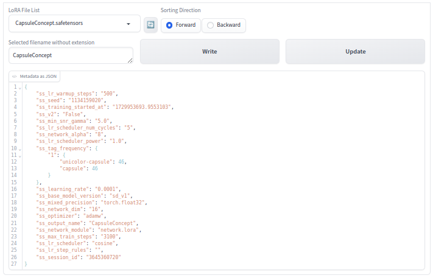

# sd-webui-lora_metadata_writer
#### :arrow_right: Extension for the AUTOMATIC1111 Web UI

sd-webui-lora_metadata_writer is an <i>Extension</i> for the <a href="https://github.com/AUTOMATIC1111/stable-diffusion-webui">AUTOMATIC1111</a>, which is adding the new functionality for modifying LoRA metadata to the <i>AUTOMATIC1111</i> web UI.

---

# Preface

There is an <i>Extension</i> that basically does what I need. Unfortunately, the <i>Extension</i> does not work and the changed metadata leads to a faulty LoRA model. Based on my current knowledge, I decided to write an <i>Extension</i> myself with the intention of using it in my daily work.

## What the Extension Does

The functionality of the <i>Extension</i> can be used when the <i>Modify LoRA Metadata</i> tab is opened. The usage of the <i>Extension</i> is straight forward. One can select a LoRA file from a dropdown menu. Sorting is possible in alphabetical forward and backward order. The selected filename without extension is shown in a text field. In parallel the JSON data is shown in text box underneath.

<i>Figure 1: Opened tab of the Extension</i>

# Known Bugs

No bugs known yet.

## Development and Test Environment

The <i>Extension</i> was devolped and tested on a machine with a <i>Debian</i> based Linux distribution istalled using the web UI <i>AUTOMATIC111</i>i> with following specification:

* API: v1.10.0
* Python: 3.10.14
* torch: 2.1.2+cu121
* xformers: 0.0.23.post1
* gradio: 3.41.2

# References

[1] https://github.com/AUTOMATIC1111/stable-diffusion-webui

[2] https://github.com/AUTOMATIC1111/stable-diffusion-webui-extensions

[3] https://www.gradio.app/docs/gradio/interface

[4] https://civitai.com/articles/8434/automatic1111-lora-extension-modify-metadata

